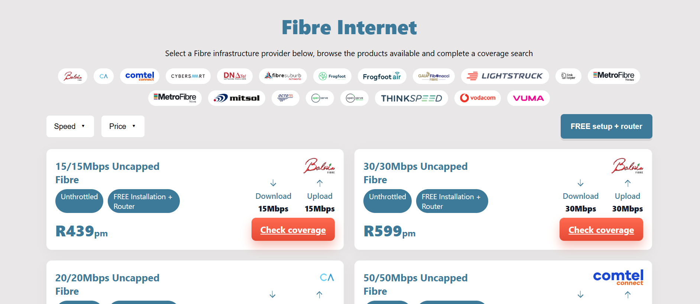

# MWEB Fibre Product Browser

A React web application to browse MWEB fibre products from multiple providers, filter by price and speed, and view coverage information. This project was originally developed for MWEB's developer assessment and showcases a clean, interactive UI with provider logos and product details.

---

## Features

- Browse MWEB fibre products from multiple providers.
- Filter products by:
  - Provider
  - Price range
  - Download speed
- Display product details including:
  - Download & upload speeds
  - Price per month
  - Provider logo
  - Coverage link
- Interactive provider chips for quick filtering.
- Mobile-friendly responsive layout.

---

## Demo



---

## Getting Started

### Prerequisites

Make sure you have **Node.js** and **npm** or **yarn** installed:

```bash
node -v
npm -v

Installation
Clone the repository:

git clone https://github.com/Phathu87/mweb-fiber-app.git
cd mweb-fiber-app

Install dependencies:


npm install
# or
yarn install
Start the development server:


npm run dev
# or
yarn dev

Open the app in your browser:
http://localhost:5173

## Project Structure

mweb-fiber-app/
├─ src/
│  ├─ assets/         # Provider logos and static assets
│  ├─ components/     # Reusable React components
│  ├─ constants/      # Price ranges and other constants
│  ├─ mockProducts.js # Mock data for products
│  ├─ pages/          # Main pages (Home, etc.)
│  └─ App.jsx         # Root component
├─ public/            # Favicon and static files
├─ package.json
└─ README.md

### Usage

1. Use the provider chips to filter products by provider.
2. Open the price or speed dropdowns to filter by price ranges or speeds.
3. Click **Check coverage** to open the provider’s coverage page for the product.

### Mock Data

- Since the MWEB API may not be publicly accessible, the app uses `MOCK_PRODUCTS` for development. Replace this with live API calls when available.


### Contributing
1. Fork the repository.
2. Create your feature branch: git checkout -b feature/my-feature.
3. Commit your changes: git commit -m 'Add some feature'.
4. Push to the branch: git push origin feature/my-feature.
5. Open a pull request.

## License

- This project is licensed under the MIT License © 2025 Phathu Rakhunwana.

## Acknowledgements

- React
- Vite
- MWEB – API reference for fibre products